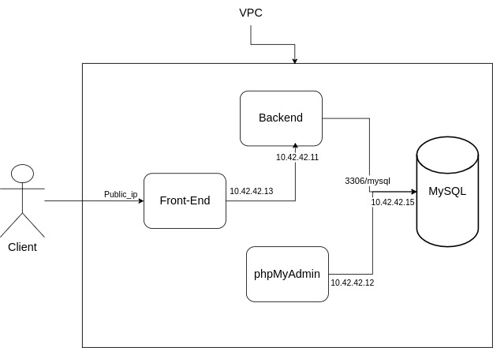

# Sujet  :

création d'une plateforme E-commerce full stack react ,django et phpMyAdmin pour maintenir la base de données MySQL sur un réseau privé cloud Scaleway et une passerelle vers ssh et l'interface utilisateur en utilisant terraform et scaleway 

## Composants Software :

- Serveur back-end pour l'E-commerce  : un serveur django pour fourninr les Api des produits
- interface utilisateur pour l'E-commerce : un front-end ReactJS pour afficher les produits
- interface utilisateur pour MySQL : un interface utilisateur phpMyAdmin pour manipuler la base de données MySQL
- une base de données MySQL

## Composants Hardware:

### instances : 

- une instance de serveur Back-end
- une instance de serveur pour le Front-end
- une instance de serveur pour phpMyAdmin
- une instance de base de données pour MySQL 
### réseau :
- un réseau privé
- une pasrelle
- DHCP
- NAT
## Architecture réseau:

- un accés sur le port 3333 pour le l'interface  du serveur Back-end
- un accés sur le port 2221 pour l'SSH du serveur backend
- un accés sur le port 8080 pour l'interface de serveur phpMyAdmin
- un accés sur le port 2222 pour l'SSH de serveur phpMyAdmin
- un accés sur le port 3000 pour l'interface utilisateur Front-end 
- un accés sur le port 2222 pour l'SSH pour le serveur du Front-end 
- il n'y a pas d'accès direct à la base de données MySQL

## Déploiement

- make init
- make plan
- make apply
#### l'ip publique affiché dans la terminale
